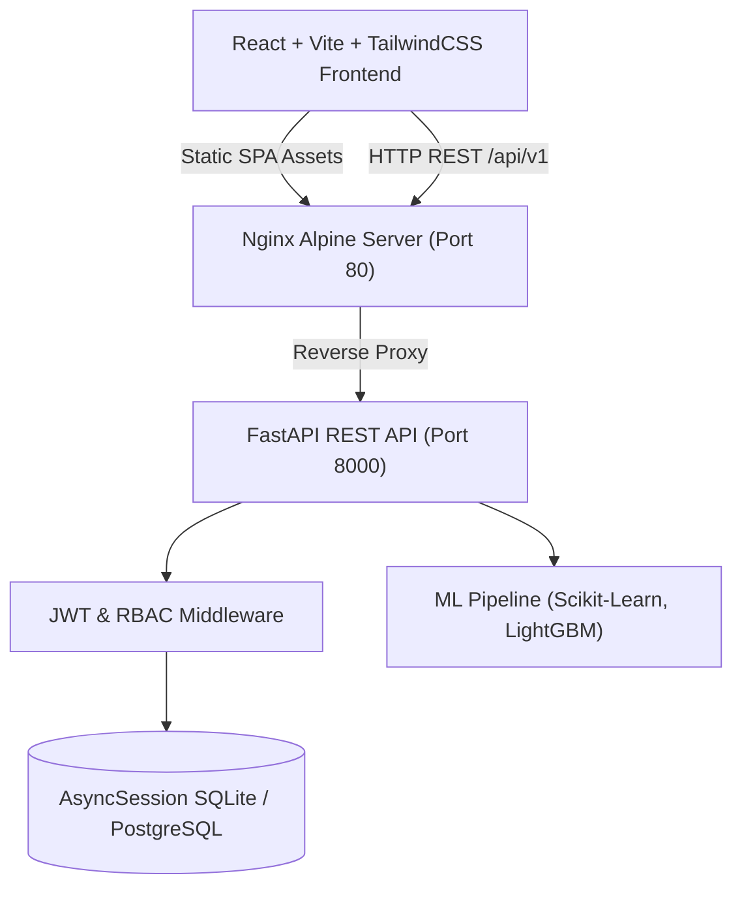

# Explorium StaffOpt V2 🚀
> **AI/ML Visitor Footfall Forecasting & Intelligent Staff Planning Engine**

StaffOpt V2 is a decoupled web application designed to forecast visitor footfall using machine learning models (Random Forest, LightGBM, Moving Average) and translate those predictions into optimal staff headcount schedules and shift rosters.

---

## 🌟 Key Features

* 📊 **Multi-Model Forecasting**: Predicts hourly & daily visitor footfall using preprocessed time-series models with upper/lower confidence bounds.
* 📈 **Performance Evaluation Dashboards**: Interactive 24-hour and 72-hour validation windows displaying MAE, RMSE, R² scores, predicted vs actual curves, and feature importance rankings.
* 👥 **Dynamic Staffing Calculator**: Interactive staffing ratio slider ($1\text{ Staff} : N\text{ Visitors}$), department filters, and automated shift block recommendations (Morning & Afternoon blocks).
* 🔐 **JWT Authentication & RBAC**: Role-Based Access Control enforcing permission gates across **Admin**, **Manager**, and **Viewer** roles.
* 🐳 **Containerized & Production Ready**: Fully dockerized stack with Nginx reverse proxying and automated GitHub Actions CI/CD.

---

## 🔑 Demo User Accounts

The backend automatically seeds pre-configured demo users on initial startup for instant testing:

| Role | Email | Password | Permissions |
| :--- | :--- | :--- | :--- |
| 🛡️ **Admin** | `admin@explorium.io` | `adminpassword` | Full control: Model retraining, data ingestion, scheduling, viewing. |
| 👔 **Manager** | `manager@explorium.io` | `managerpassword` | Staffing ratio configuration, schedule generation, data viewing. |
| 👁️ **Viewer** | `viewer@explorium.io` | `viewerpassword` | Read-only access to forecast dashboards. |

---

## 🏗️ Architecture Overview



---

## 🚀 Quickstart Guide

### Option 1: Launch via Docker Compose (Recommended)

Run the entire application stack (Frontend + Backend + Reverse Proxy) with a single command:

```bash
# Clone the repository
git clone https://github.com/your-username/staffopt-v2.git
cd staffopt-v2

# Build and start services
docker-compose up --build
```

Access the services at:
* 🌐 **Frontend App**: `http://localhost`
* ⚡ **Backend REST API**: `http://localhost:8000/api/v1`
* 📚 **Interactive Swagger API Docs**: `http://localhost:8000/api/v1/openapi.json`

---

### Option 2: Local Development Setup

#### Backend (FastAPI + Python)
```bash
cd backend
python -m venv .venv
source .venv/bin/activate  # On Windows: .venv\Scripts\activate
pip install -r requirements.txt
uvicorn main:app --reload --port 8000
```

#### Frontend (React + Vite)
```bash
cd frontend
npm install
npm run dev
```

---

## 📡 REST API Reference

| Endpoint | Method | Role Required | Description |
| :--- | :--- | :--- | :--- |
| `/api/v1/health` | `GET` | Public | System health check and data directory status |
| `/api/v1/auth/login` | `POST` | Public | Authenticates credentials and returns JWT bearer token |
| `/api/v1/auth/me` | `GET` | Authenticated | Returns active user profile and role |
| `/api/v1/forecast/latest` | `GET` | Authenticated | Fetches latest footfall predictions |
| `/api/v1/forecast/evaluation` | `GET` | Authenticated | Retrieves 24h & 72h model performance metrics |
| `/api/v1/forecast/train` | `POST` | `Admin` | Triggers ML pipeline retraining on backend dataset |
| `/api/v1/data/ingest` | `POST` | `Admin`, `Manager` | Ingests new historical footfall dataset |

---

## 📁 Repository Structure

```text
├── backend/
│   ├── app/
│   │   ├── api/          # API v1 Router & Endpoints (auth, forecast, data)
│   │   ├── core/         # Security, JWT tokens & settings configuration
│   │   ├── db/           # AsyncSession SQLAlchemy models & session
│   │   └── ml/           # Preprocessing, feature engineering & forecaster
│   ├── main.py           # FastAPI entrypoint & lifespan initialization
│   ├── Dockerfile        # Backend production Dockerfile
│   └── requirements.txt
├── frontend/
│   ├── src/
│   │   ├── components/   # Forecast & evaluation React components
│   │   ├── context/      # AuthContext provider & role hooks
│   │   └── services/     # API fetch layer & JWT token management
│   ├── nginx.conf        # Production Nginx SPA & proxy routing
│   └── Dockerfile        # Frontend multi-stage Dockerfile
├── .github/workflows/    # CI/CD deployment automation
├── docker-compose.yml    # Root Docker Compose orchestrator
└── README.md
```

---

## 📄 License
Distributed under the MIT License. See `LICENSE` for details.